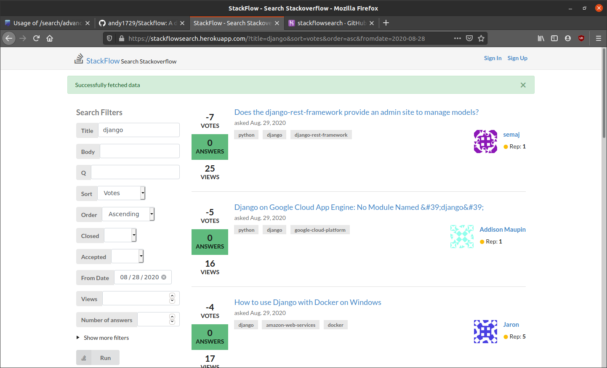
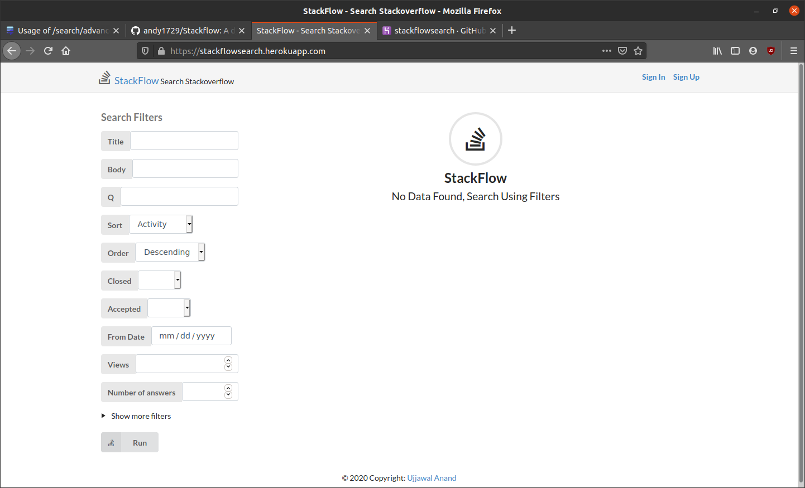
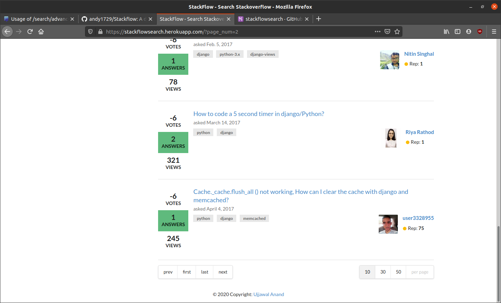
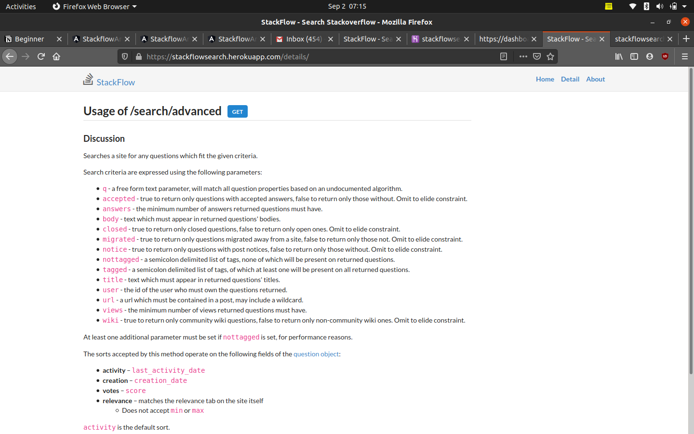
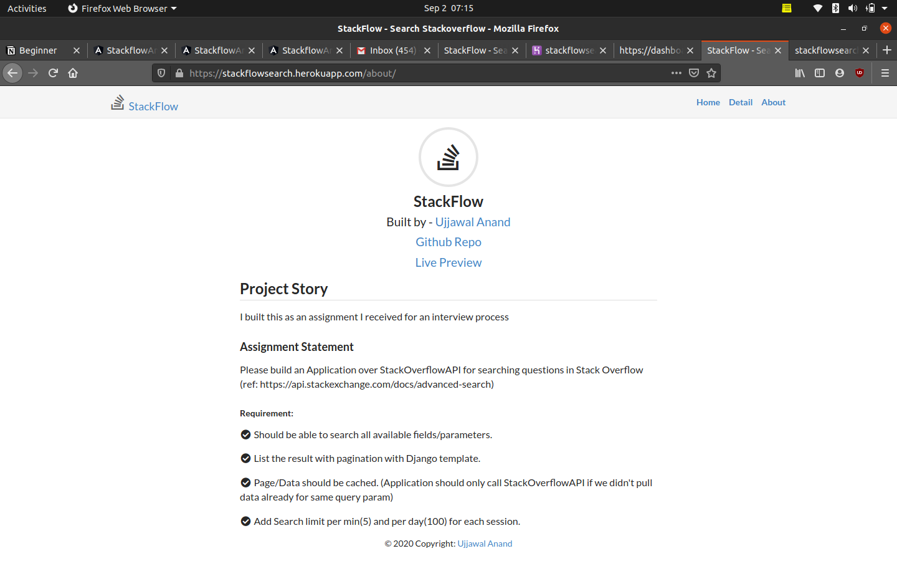

  <h1>Stackflow </h1>
  

Request - Please star 🌟 the repo, if you find it helpful

Live at https://stackflowsearch.herokuapp.com/

Angular version of same app : https://github.com/andy1729/Stackflow-angular

This django app is wrapper of [Stackoverflow advanced search api](https://api.stackexchange.com/docs/advanced-search)

I built this as an assignment I received for an interview process

### Assignment Statement
Please build an Application over StackOverflowAPI for searching questions in StackOverflow [link](https://api.stackexchange.com/docs/advanced-search)

**Requirements:**

- [x] Should be able to search all available fields/parameters. 
- [x] List the result with pagination with Django template.
- [x] Page/Data should be cached. (Application should only call 
        StackOverflowAPI if we didn't pull data already for same query param)
- [x] Add Search limit per min(5) and per day(100) for each session.
- [ ] Using Restful API and angular/react bonus

### More Screenshot

**Empty View**

**Pagination**

**Details Page**

**About Page**

